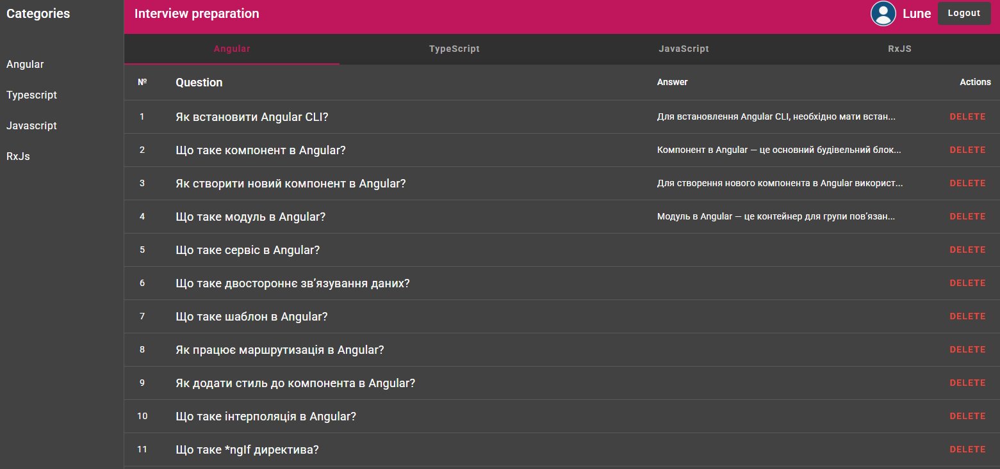

# Interview Master

A comprehensive Angular application designed to help developers prepare for technical interviews. This application provides a collection of interview questions and answers across various technical categories including Angular, TypeScript, JavaScript, and RxJS.

## Features

- **Category-based Questions**: Browse questions organized by technology categories
- **Preparation Mode**: Special preparation mode to help you study effectively
- **Modern UI**: Built with Angular Material for a clean, responsive interface
- **Backend Integration**: Uses JSON Server with authentication for data management

## Application Screenshot

Below is a screenshot of the application interface showing the main question listing page with categories:



*The screenshot shows the application's interface with question categories, a list of Angular interview questions in Ukrainian, and user management features.*

## Tech Stack

- **Frontend**: Angular 19.2.9 with Angular Material
- **Backend**: JSON Server with authentication
- **Authentication**: JWT-based authentication
- **Styling**: SCSS for advanced styling capabilities

## Prerequisites

- Node.js (latest LTS version recommended)
- npm or Bun package manager

## Installation

1. Clone the repository
2. Install dependencies:
   ```
   npm install
   ```
   or if using Bun:
   ```
   bun install
   ```

## Running the Application

The application consists of both frontend and backend components. You can start both simultaneously with:

```
npm start
```

This will:
- Start the Angular frontend on `http://localhost:4200`
- Start the JSON Server backend on `http://localhost:3000`

### Running Components Separately

- Frontend only: `npm run start:frontend`
- Backend only: `npm run start:backend`

## Building for Production

```
npm run build:prod
```

The build artifacts will be stored in the `dist/` directory.

## Development

### Code Scaffolding

Run `ng generate component component-name` to generate a new component. You can also use `ng generate directive|pipe|service|class|guard|interface|enum|module`.

### Running Tests

Run `npm test` to execute the unit tests via [Karma](https://karma-runner.github.io).

## Deployment

The application is configured for deployment on Netlify with the included `netlify.toml` configuration file.

## Project Structure

- `src/app/components`: Angular components
- `src/app/services`: Services for data management and business logic
- `src/app/models`: Data models and interfaces
- `src/app/directives`: Custom directives
- `src/app/pipes`: Custom pipes
- `server/db.json`: Backend database with questions and categories
- `server/routes.json`: API route configuration

## License

This project is licensed under the MIT License.
